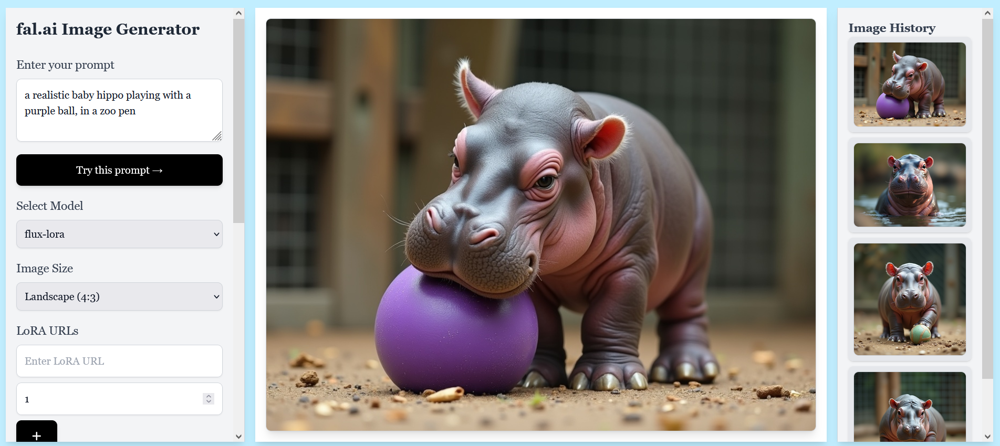

# fal-ai-web-ui

A versatile and extendable web UI for FAL-AI, designed to seamlessly integrate with any FAL-AI API endpoint. This interface supports models, custom LoRAs, and more, offering an intuitive way to generate AI-based images using FAL-AI.



---

## Table of Contents

1. [Getting Started](#getting-started)
2. [Environment Variables](#environment-variables)
3. [Running the Development Server](#running-the-development-server)
4. [Using the Application](#using-the-application)
   - [Prompt and Image Generation](#prompt-and-image-generation)
   - [Model Selection](#model-selection)
   - [LoRA Integration](#lora-integration)
   - [Image History](#image-history)
5. [API Endpoints](#api-endpoints)
   - [Generate Image API](#generate-image-api)
   - [Get Generated Images API](#get-generated-images-api)
6. [Learn More](#learn-more)
7. [Deploy on Vercel](#deploy-on-vercel)
8. [Additional Notes](#additional-notes)

---

## Getting Started

To get started with this project, you will need to clone this repository and install the required dependencies.

### Prerequisites

- Node.js (v14.x or later)
- NPM, Yarn, or PNPM package managers
- A FAL-AI API key (which you can obtain from [fal.ai](https://fal.ai/dashboard/keys))

### Installation

After cloning the repository, install the dependencies by running:

```bash
npm install
# or
yarn install
# or
pnpm install
# or
bun install
```

## Environment Variables

Create a `.env.local` file in the root of the project and set the following variable with your own FAL-AI API key:

```bash
FAL_KEY={{your fal.ai API key here}}
```

You can obtain your API key by signing up at [FAL-AI](https://fal.ai).

## Running the Development Server

Once you've set up your API key, run the development server with one of the following commands:

```bash
npm run dev
# or
yarn dev
# or
pnpm dev
# or
bun dev
```

Open [http://localhost:3000](http://localhost:3000) with your browser to see the web UI in action.

## Using the Application

### Prompt and Image Generation

The web UI allows you to input a prompt to generate images. You can tweak additional parameters like image size, number of inference steps, guidance scale, number of images, and more.

To generate an image:

1. Enter a description in the **Prompt** field.
2. Adjust the image settings (optional).
3. Click **Try this prompt →** to generate the image.

The generated image will be displayed in the central panel once the process is complete.

### Model Selection

You can select from different models to fine-tune your image generation results. The following models are available:

- `fal-ai/flux-lora`
- `fal-ai/flux/dev`
- `fal-ai/flux-realism`

### LoRA Integration

This project allows you to input a custom LoRA (Low-Rank Adaptation) URL, enabling further customization of the AI output. You can set the LoRA URL in the web form, and it will be used during the image generation process.

### Image History

The right sidebar displays the history of generated images. Clicking on any of these images will load them back into the main display area.

## API Endpoints

This project includes API endpoints for generating images and fetching previously generated images.

### Generate Image API

**POST** `/api/generateImage`

This endpoint accepts the following parameters:

- `prompt`: The text prompt for the image.
- `image_size`: The size of the generated image (e.g., `landscape_4_3`).
- `num_inference_steps`: The number of steps for inference.
- `guidance_scale`: The guidance scale for the image generation.
- `num_images`: The number of images to generate.
- `enable_safety_checker`: Boolean to enable/disable the safety checker.
- `strength`: The strength of the generated image.
- `output_format`: Format of the generated image (e.g., `jpeg` or `png`).
- `sync_mode`: Whether to run in synchronous mode.
- `model`: The model used for generating the image.
- `loras`: Optional array of LoRAs to apply during image generation.

### Get Generated Images API

**GET** `/api/getGeneratedImages`

This endpoint returns a list of generated images from the `outputs` directory.

## Learn More

To learn more about Next.js, take a look at the following resources:

- [Next.js Documentation](https://nextjs.org/docs) - Learn about Next.js features and API.
- [Learn Next.js](https://nextjs.org/learn) - An interactive Next.js tutorial.

You can check out the [Next.js GitHub repository](https://github.com/vercel/next.js/) - your feedback and contributions are welcome!

## Deploy on Vercel

The easiest way to deploy your Next.js app is to use the [Vercel Platform](https://vercel.com/) from the creators of Next.js.

Check out the [Next.js deployment documentation](https://nextjs.org/docs/deployment) for more details.

## Additional Notes

- Make sure to use your own FAL-AI API key, which can be set in the `.env.local` file as `FAL_KEY`.
- Ensure the `outputs` directory exists in the `public` folder for storing generated images.

---